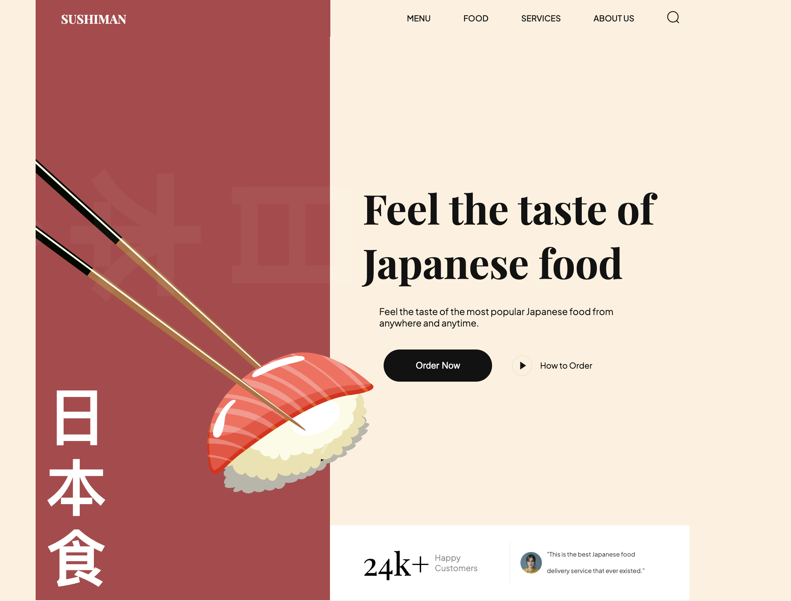

# 🍣Sushiman Website

Welcome to the Sushi Website project! This project showcases popular sushi dishes and drinks with a sleek, modern design, using HTML, CSS, and JavaScript. 

## 🤖 Introduction
This sushi website is designed to present a vibrant and engaging interface for showcasing various sushi dishes and drinks. The project focuses on user experience through smooth animations and a responsive layout. 

## ⚙️ Tech Stack
- HTML 5
- CSS 3
- JavaScript
- Vite (for development)
- AWS Amplify (for hosting)

## 🔋 Features
- **Responsive Design:** The site is fully responsive and works seamlessly on all devices.
- **Smooth Animations:** Enhances user experience with subtle animations.
- **CSS Variables:** Maintains consistent styling throughout the project.
- **Modular CSS:** Promotes organization and modularity by importing CSS files.
- **BEM Methodology:** Utilizes BEM for class naming, ensuring a clear and maintainable structure.
- **Dynamic Content Rendering:** Leverages JavaScript for dynamic content updates.
- **User-friendly Navigation:** Easy navigation for users to explore different sections.

🔗 [Demo](https://main.d38cdufbbus6fk.amplifyapp.com/)

